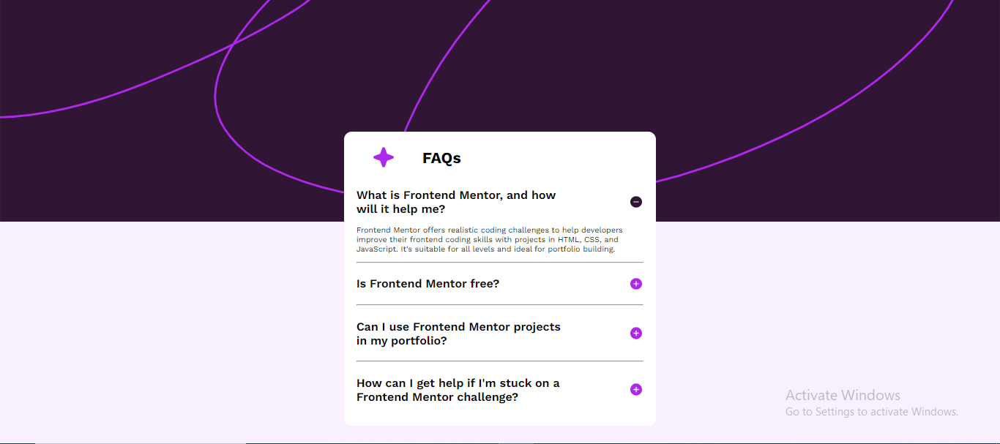
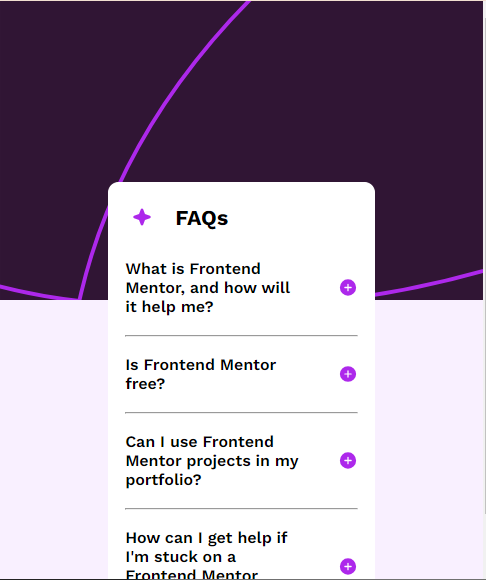

# Frontend Mentor - FAQ accordion solution

This is a solution to the [FAQ accordion challenge on Frontend Mentor](https://www.frontendmentor.io/challenges/faq-accordion-wyfFdeBwBz). 

## Table of contents

- [Overview](#overview)
  - [The challenge](#the-challenge)
  - [Screenshot](#screenshot)
  - [Links](#links)
- [My process](#my-process)
  - [Built with](#built-with)
  - [What I learned](#what-i-learned)
  - [Continued development](#continued-development)
- [Author](#author)

## Overview

### The challenge

Users should be able to:

- Hide/Show the answer to a question when the question is clicked
- Navigate the questions and hide/show answers using keyboard navigation alone
- View the optimal layout for the interface depending on their device's screen size
- See hover and focus states for all interactive elements on the page

### Screenshot

### Links

- Git Hub Repo URL: [Git Hub Repo Link](https://github.com/KrishnaPoddar1/FAQTemplete.git)
- Live Site URL: [Live site URL](https://krishnapoddar1.github.io/FAQTemplete/)

## My process

### Built with

- Semantic HTML5 markup
- CSS custom properties
- Flexbox
- CSS Grid
- Mobile-first workflow
- JavaScript 
- Visual Studio Code

### What I learned

Utilizing Javascript efficiently.

### Continued development

To make it so that I can animate this code and make it such that whereever it is clicked in the question block it opens the question. And also to use the keyboard input.

## Author

- Frontend Mentor - [@KrishnaPoddar1](https://www.frontendmentor.io/profile/KrishnaPoddar1)
